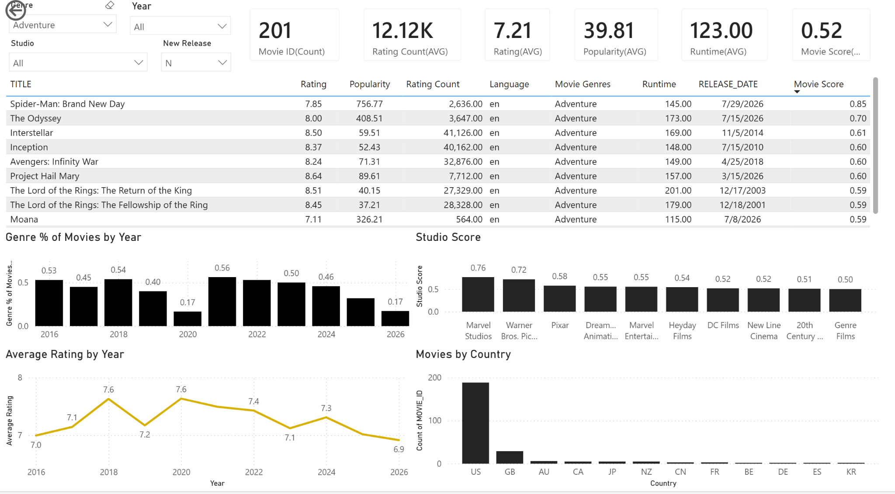
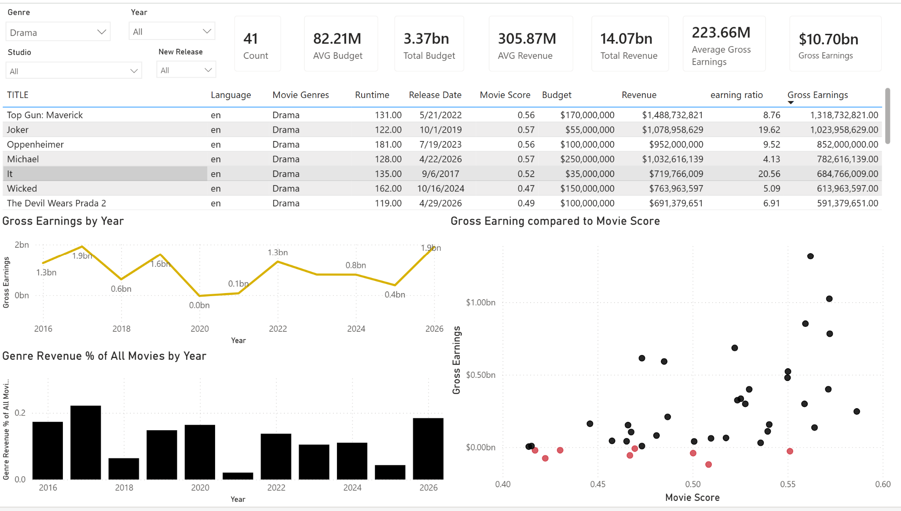

# StreamSight

StreamSight is an end-to-end analytics engineering project that ingests movie and people data from the TMDb API, loads it into Snowflake, transforms it with dbt, and serves curated analytics through Power BI.

## Live Dashboard

[View the interactive Power BI dashboard](https://app.powerbi.com/view?r=eyJrIjoiMzc3ODM0ZmEtNGY3YS00ZDRkLTkzMWQtZTUyMDg2MDBhNmU0IiwidCI6ImY2MjZlZmI2LThiNTctNGZhNy04YWZhLWE2ODFiMTkwZDA4NCJ9&embedImagePlaceholder=true)

## Project Status

**Active** — the production pipeline runs weekly and the Power BI semantic model is scheduled to refresh from Snowflake.

## Dashboard Preview

### Movie Overview



### Movie Financials



## Project Overview

The project was built to practice and demonstrate analytics engineering concepts including:

- API ingestion with Python
- Raw data loading into Snowflake
- Incremental models and snapshots in dbt
- Dimensional modeling
- Data quality testing
- GitHub Actions orchestration
- Power BI semantic modeling and dashboard design

## Architecture

TMDb API  
→ Python ingestion  
→ Snowflake RAW  
→ dbt staging / snapshots / marts  
→ Power BI

## Tech Stack

- Python
- TMDb API
- Snowflake
- dbt
- GitHub Actions
- Power BI
- Git / GitHub

## Data Pipeline

Python pulls data from several TMDb endpoints, including:

- Popular movies
- Movie details
- Movie credits
- Genres
- Person details
- Production company details

The ingestion layer loads data into the `STREAMSIGHT.RAW` schema.

dbt then transforms the raw data into:

- staging models
- historical snapshots
- dimensions
- reference tables
- bridge tables

The final marts are consumed by Power BI.

## Data Model

Core models include:

- `dim_movies`
- `dim_movie_history`
- `dim_people`
- `dim_companies`
- `ref_genres`
- `bridge_movie_genres`
- `bridge_movie_credits`
- `bridge_movie_companies`

## Key Engineering Features

- Incremental dbt models using merge strategies
- dbt snapshots for historical movie and person metrics
- Retry and error handling for TMDb API requests
- Persistent tracking of successful person-detail API pulls
- Shadow-table validation before replacing RAW tables
- Automated weekly pipeline execution through GitHub Actions
- Scheduled Power BI refreshes
- dbt relationship, uniqueness, and not-null tests

## Dashboard

The Power BI report includes:

- Movie Overview
- Movie Detail
- Movie Financials
- People Overview

Analysis includes:

- movie rating and popularity
- composite movie scores
- revenue and budget performance
- studio performance
- genre comparisons
- cast and crew analysis
- historical metric changes

## Automation

The production pipeline runs automatically through GitHub Actions.

The workflow:

1. Runs the Python ingestion process
2. Loads fresh data into Snowflake
3. Triggers the dbt production job
4. Updates production marts
5. Power BI refreshes from Snowflake

## Repository Structure

```text
.
├── .github/
│   └── workflows/
│       └── pipeline.yml
│
├── analyses/
│   └── .gitkeep
│
├── macros/
│   └── .gitkeep
│
├── models/
│   ├── marts/
│   │   ├── bridge_movie_companies.sql
│   │   ├── bridge_movie_credits.sql
│   │   ├── bridge_movie_genres.sql
│   │   ├── dim_companies.sql
│   │   ├── dim_movie_history.sql
│   │   ├── dim_movies.sql
│   │   ├── dim_people.sql
│   │   └── ref_genres.sql
│   │
│   └── staging/
│       ├── sources.yml
│       ├── stg_bridge_movie_company.sql
│       ├── stg_bridge_movie_credits.sql
│       ├── stg_bridge_movie_genre.sql
│       ├── stg_companies.sql
│       ├── stg_movies.sql
│       └── stg_people.sql
│
├── python/
│   ├── DBT_config.py
│   ├── config.py
│   ├── dbt_run_monitor.py
│   ├── main.py
│   ├── snowflake_loader.py
│   ├── tmdb_api.py
│   └── transformations.py
│
├── seeds/
│
├── snapshots/
│   ├── .gitkeep
│   └── snapshots.yml
│
├── tests/
│
├── .gitignore
├── README.md
├── dbt_project.yml
└── requirements.txt
```

## What I Learned


## Data Source

Movie data is sourced from TMDb.

This product uses the TMDb API but is not endorsed or certified by TMDb.
